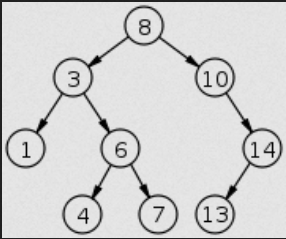
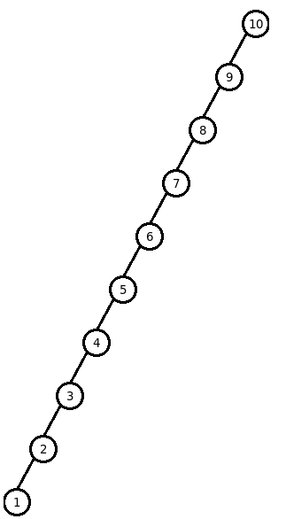

# Binary Search Tree
A Binary Search Tree is a rooted binary tree data structure, with an aditional constraint.   That is: 
<b>All elements in the right sub-tree of a node must be greter than (>) the node and 
all elements in the left sub-tree of a node must be lower than (<) the node.</b>
This allows to perform a [binary search](https://en.wikipedia.org/wiki/Binary_search_algorithm) in the tree.  

## Degenerate BSTree
The performance of a binary search depends on the order of insertion of the nodes.Arbitrary insertions may lead to degeneracy.  
Imagine we have a BSTree that stores ints, and we add all natural numbers from 10 to 1, in descendent order.  
Beause of the nature of this structure, this tree would behave like a linked list, since all elements would be added to the left of the previous node.

To fix this issue, there are other Binary Search Tree structures that are <b>balanced</b>, this means they avoid this behaviour by rearranging it's elements.
An example of this kind of structures are [AVL Trees](/src/AVLTree/), also implemented in this suite.

## Time complexity
| Operation  | Average Case | Worst Case |
|--- | --- | ---|
| Add        | O(log n)	    | O(n)   |
| Delete    | O(log n)     | O(n)   |
| Search     | O(log n)	    | O(n)       |

## Resources
* [Wikipedia](https://en.wikipedia.org/wiki/Binary_search_tree)
* [Data Structures (Trees) by Martin Gonzalez Rodriguez](https://www.lulu.com/shop/martin-gonzalez-rodriguez/data-structures-trees/ebook/product-22017004.html?q=&page=1&pageSize=4)